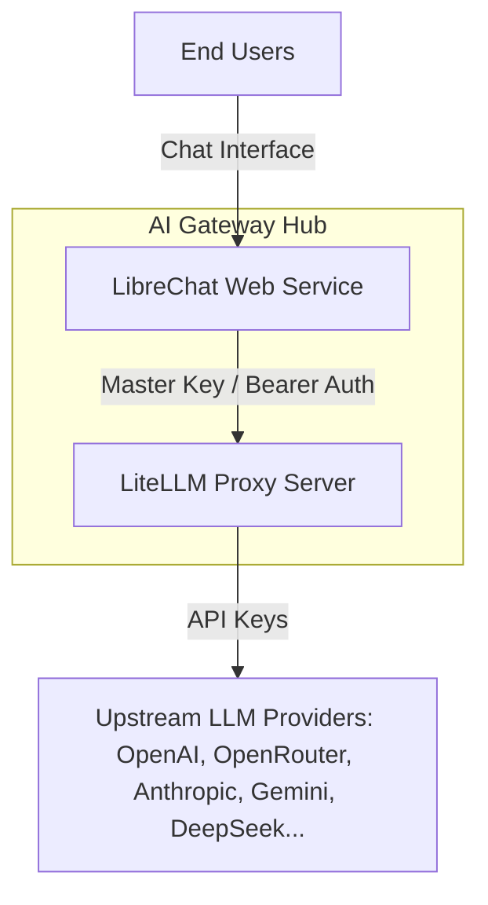

# AI Proxy Hub Documentation (`ai-proxy`)

A unified AI Gateway and Multi-User Chat platform combining **LibreChat** (Chat UI) and **LiteLLM Proxy** (AI Gateway).

---

## 1. Architecture Overview



* **LibreChat:** Web interface for end users, managing authentication, chat histories, and user settings via MongoDB.
* **LiteLLM Proxy:** High-performance, stateless AI Gateway handling API key security, load balancing, and multi-provider model routing behind a unified OpenAI-compatible `/v1` endpoint.

---

## 2. Configuration & Integration

### Step 1: Configure LibreChat (`LibreChat/librechat.yaml`)

Create or verify `LibreChat/librechat.yaml` with the custom endpoint definition:

```yaml
version: 1.3.5
cache: true

endpoints:
  custom:
    - name: "AI Gateway"
      apiKey: "${LITELLM_MASTER_KEY}"
      baseURL: "${LITELLM_BASE_URL}"
      models:
        default: ["gpt-4o-mini"]
        fetch: true                  # Auto-synchronizes available models from LiteLLM Proxy
      titleConvo: true
      titleModel: "gpt-4o-mini"
      modelDisplayLabel: "AI Gateway (LiteLLM)"
```

---

### Step 2: Configure LiteLLM Environment Variables

Set the following environment variables for LiteLLM Proxy:

```env
PORT=4000
LITELLM_MASTER_KEY=sk-litellm-master-9f8a7b6c5d4e3f2a1b0c9d8e7f

# Upstream Provider API Keys
OPENROUTER_API_KEY=sk-or-v1-xxxxxxxxxxxx
OPENAI_API_KEY=sk-proj-xxxxxxxxxxxx
ANTHROPIC_API_KEY=sk-ant-xxxxxxxxxxxx
GEMINI_API_KEY=AIzaSyxxxxxxxxxxxx
DEEPSEEK_API_KEY=sk-xxxxxxxxxxxx
```

---

### Step 3: Configure LibreChat Environment Variables

Set the following environment variables for LibreChat:

```env
LITELLM_BASE_URL=https://<your-litellm-service-domain>/v1
LITELLM_MASTER_KEY=sk-litellm-master-9f8a7b6c5d4e3f2a1b0c9d8e7f
```

---

## 3. Quick Verification

1. **Verify Liveness Probe:**
   Access `https://<your-litellm-service-domain>/health/liveness` (returns `{"status": "healthy"}`).

2. **Verify API Specification:**
   Access `https://<your-litellm-service-domain>` to view Swagger UI OpenAPI documentation.

3. **Start Chatting:**
   Open LibreChat UI, select **"AI Gateway (LiteLLM)"** from the model provider dropdown, pick a model, and start chatting.
